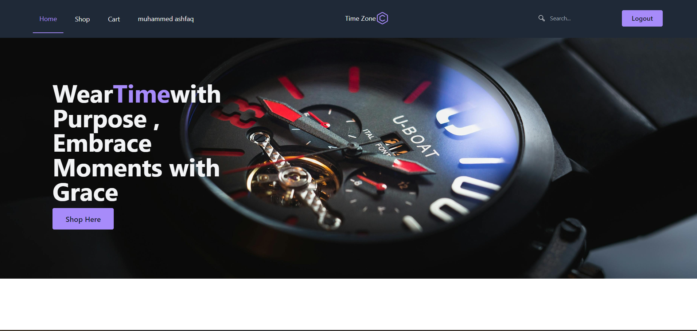
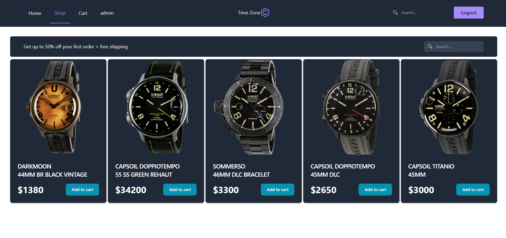

# MERN eCommerce Site 🛍️

## Project Overview

Welcome to our MERN eCommerce site! This full-stack application is built using the MERN (MongoDB, Express.js, React, Node.js) stack, providing a seamless shopping experience with features like a robust shopping cart, a secure checkout process, and detailed product pages.

## Key Features

- **Shopping Cart**: Users can add products to their cart, review items, and proceed to checkout.
- **Checkout Process**: Secure and smooth checkout flow for users to complete their purchase.
- **Product Details**: Comprehensive information and visuals for each product.
- **Responsive Design**: Ensures a seamless experience across various devices.
- **Performance**: Optimized for speed and efficiency.

## Technologies Used

### Backend

- **MongoDB**: NoSQL database for efficient and scalable data storage.
- **Express.js**: Web application framework for building robust APIs.
- **Node.js**: JavaScript runtime for server-side development.
- **Bcrypt**: Hashing library for secure password storage.
- **Cloudinary**: Cloud-based image and video management for media assets.
- **CORS**: Middleware for handling Cross-Origin Resource Sharing.
- **Crypto**: Library for cryptographic functionality.
- **Dotenv**: Module for loading environment variables.
- **Express Async Handler**: Utility for handling asynchronous errors.
- **JSON Web Token (jsonwebtoken)**: Secure user authentication.
- **Mongoose**: MongoDB object modeling for Node.js.
- **Multer**: Middleware for handling file uploads.
- **Nodemailer**: Module for sending emails.
- **Nodemon**: Utility for automatic server restarts during development.
- **Sharp**: Image processing library.

### Frontend

- **React**: JavaScript library for building user interfaces.
- **Redux Toolkit**: State management for React applications.
- **Axios**: HTTP client for making API requests.
- **Dotenv**: Module for loading environment variables.
- **Flowbite React**: UI toolkit for building modern and responsive interfaces.
- **React Router DOM**: Navigation for React applications.
- **React Icons**: Icon library for React applications.
- **React Redux**: Official React bindings for Redux.
- **React Scripts**: Scripts and configurations for React applications.
- **Tailwind CSS**: Utility-first CSS framework for styling.

## Project Structure

The project follows a modular structure. Here's a brief overview:

- **`/server`**: Backend server code.
- **`/client`**: Frontend React application.

Happy Shopping! 🎉✨
